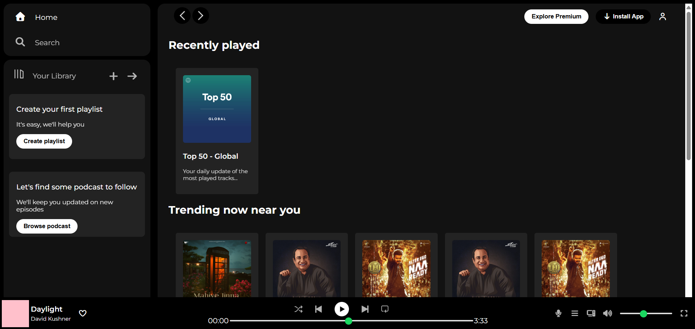

# 🎵 Spotify Clone

A responsive Spotify-inspired music player interface built using **HTML** and **CSS**. This project recreates the look and feel of Spotify's desktop UI and was created to improve my frontend development skills.

## 📸 Preview

<h2>Preview</h2>



## 🚀 Features

- 🎧 Spotify-inspired user interface
- 🎨 Clean and modern design
- 📱 Responsive layout
- 🎵 Music player section
- 📂 Sidebar navigation
- 📋 Playlist section
- ❤️ Like (heart) icon
- 🔍 Search and navigation bar

## 🛠️ Technologies Used

- HTML5
- CSS3
- Font Awesome (for icons)
- Google Fonts

## 📁 Project Structure

```
spotify-clone/
│── index.html
│── style.css
│── assets/
│── images/
│── README.md
```

## ▶️ How to Run

1. Clone the repository

```bash
git clone https://github.com/Rewagupta/spotify-clone.git
```

2. Open the project folder.

3. Open `index.html` in your browser.

## 🎯 Learning Objectives

This project helped me practice:

- HTML structure
- CSS Flexbox
- Responsive web design
- UI cloning
- File organization

## 📌 Future Improvements

- Add JavaScript functionality
- Music playback controls
- Dark/Light mode
- Responsive mobile design
- Connect with Spotify API

## 👩‍💻 Author

**Rewa Gupta**

- GitHub: https://github.com/your-username

## ⭐ Support

If you like this project, consider giving it a ⭐ on GitHub!

---

*This project is created for educational purposes only and is not affiliated with Spotify.*